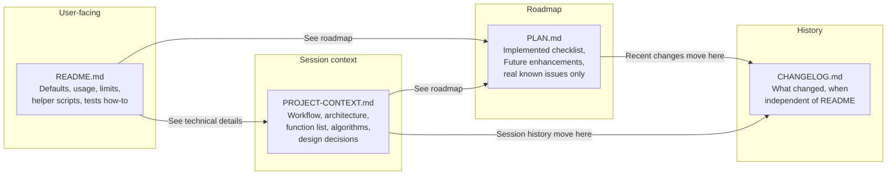

# Documentation Overlap and Context Cleanup

**Status: Complete** (Session 1 + Session 2 done.)

**Location:** This plan lives in the project at [plans/Completed/CONTEXT-REFACTOR-PLAN.md](CONTEXT-REFACTOR-PLAN.md) and is the source of truth for the context refactor. Work from this document (not from a Cursor- or tool-specific artifact).

---

## Roles of Each Document (Target State)

| Document | Primary audience | Best use in context windows |
|----------|------------------|-----------------------------|
| **README.md** | Users (install, run, options, troubleshooting) | Quick user-facing summary; link to others. |
| **PLAN.md** | Maintainer + AI (roadmap, status, future work) | "What's done, what's next"; single place for future enhancements. |
| **PROJECT-CONTEXT.md** | AI + maintainer (how to work on the project, how the code works) | Workflow rules, architecture, function map, design decisions—minimal history. |
| **CHANGELOG.md** | Users + maintainers (what changed, when) | Versioned history; independent of README. |

---

## Changelog: Recommendation

**Opinion:** The project is missing a changelog that is independent of the README, and it should add one.

- **README** answers “what is this, how do I use it, what’s coming.” It describes current state and usage. It is not a versioned history of changes.
- A dedicated **CHANGELOG** (e.g. [Keep a Changelog](https://keepachangelog.com/) style) is standard practice and serves a different role:
  - **Users** can see what changed between versions without re-reading the whole README.
  - **Maintainers** have a single place for “what we shipped” that doesn’t clutter PROJECT-CONTEXT or PLAN.
  - **Session history** (the “Previous Session” blocks in PROJECT-CONTEXT) can be summarized or migrated into CHANGELOG as dated/versioned entries, then removed from PROJECT-CONTEXT—so there is one canonical history instead of long narrative blocks in the context doc.

So: add **CHANGELOG.md** as a first-class doc. Use it to absorb the “record of what we’ve done” that we’re removing from PROJECT-CONTEXT and from PLAN’s “Recent Changes” bullets. Keep README focused on current state and usage; keep CHANGELOG focused on what changed and when. Context windows can omit CHANGELOG unless someone asks for history.

---

## Overlap to Reduce

### 1. Current defaults (codec, bitrates, container, quality)

**Today:** Repeated in [PLAN.md](../PLAN.md) (Current Defaults), [README.md](../README.md) (Current Defaults), and [PROJECT-CONTEXT.md](../PROJECT-CONTEXT.md) (Encoding Settings, Bitrate Targeting).

**Recommendation:** Treat **README** as source of truth for user-visible defaults. **PROJECT-CONTEXT** keeps only what’s needed for implementation (e.g., algorithm details, not full bullet list). **PLAN** can drop the "Current Defaults" block and keep only defaults that are explicitly part of the roadmap (e.g. "Starting quality: 60" only if you’re adding a config for it).

### 2. Helper scripts

**Today:** Full list + descriptions in both [PLAN.md](../PLAN.md) (Helper Scripts) and [README.md](../README.md) (Troubleshooting > Helper Scripts).

**Recommendation:** Keep the full list only in **README**. In **PLAN**, replace the helper-scripts list with one line: "Helper scripts (copy-*, cleanup-*, remux-only): see README."

### 3. Test suite (counts, how to run)

**Today:** In PLAN (Implemented + Known Issues + Development Workflow), README (Running Tests), PROJECT-CONTEXT (Testing Before Committing, Testing Infrastructure, and session blocks with "259 tests", "188+", etc.).

**Recommendation:**
- **README:** Keep "Running Tests" (how to run, which suite when).
- **PROJECT-CONTEXT:** Keep "Testing Before Committing" (workflow requirement). Keep a short "Testing" subsection under Current Implementation: purpose, that mocking is used, that tests don’t need FFmpeg. Remove test-count progression from session history. (Do not link to plans/In Progress/TEST-REFACTOR-PLAN.md—it is a state file for a longer-term test migration, not permanent documentation.)
- **PLAN:** In Implemented Features, one bullet: "Test suite (legacy + bats); see README for how to run." No duplicate test-count or workflow text.

### 4. Known issues / limitations

**Today:** [PLAN.md](../PLAN.md) "Known Issues / Recent Changes" (mix of limitations and changelog), [README.md](../README.md) "Limitations", [PROJECT-CONTEXT.md](../PROJECT-CONTEXT.md) "Known Issues" and "Current Limitations".

**Recommendation:**
- **User-facing:** Only in **README** (Limitations).
- **Technical / bugs:** One "Known issues" in **PROJECT-CONTEXT** (e.g. FFmpeg cleanup on interrupt).
- **PLAN:** Rename "Known Issues / Recent Changes" to something like "Implementation notes" or split: "Known issues" (only items that affect roadmap) and move "Recent Changes" into **CHANGELOG.md**.

### 5. Future enhancements

**Today:** Full roadmap in **PLAN**; summary + link in **README**; **PROJECT-CONTEXT** has "Future Enhancements (See PLAN.md)", then "Smart Pre-processing" and "Future Direction" that partly duplicate PLAN/README.

**Recommendation:** **PLAN** is the single roadmap. **PROJECT-CONTEXT:** Keep one short "Future direction" paragraph that says "See PLAN.md and README for roadmap and user-facing future features." Remove the duplicate "Smart Pre-processing" subsection (current behavior is already under Current Implementation; future work is in PLAN). Keep in PROJECT-CONTEXT only future items that change architecture (e.g. border detection) as a one-line pointer if useful.

### 6. How it works / architecture

**Today:** README "How It Works" (steps 1–8), PROJECT-CONTEXT "Architecture" (1–9) + "Core Components" + "Quality Optimization Algorithm".

**Recommendation:** No change to split: README = high-level for users; PROJECT-CONTEXT = detailed reference. Optionally add in README: "For implementation details see PROJECT-CONTEXT.md."

---

## What Is "Record of What We've Done" (Trim or Relocate)

These sections are session history / changelog. They are poor material for future context windows (long, repetitive, and mostly "what we did" rather than "what the system is and how to work on it").

### In PROJECT-CONTEXT.md

1. **"Current Session Status" and all "Previous Session (...)" blocks (roughly lines 272–415)**
   - Content: "Latest Session (Predictable File Processing Order)", "Previous Session (Remuxed-but-Never-Transcoded)", "Previous Session (Remux-Only Script)", "Previous Session (Configurable Subdirectory Depth)", etc., with implementation details and test counts (259, 188+, 183, …).
   - **Recommendation:** Remove from PROJECT-CONTEXT. **Lift-and-shift** the content into CHANGELOG verbatim first; then, in a separate step, consider summarizations together before rewriting CHANGELOG. If you keep anything in PROJECT-CONTEXT, keep at most one short "Last session" (3–5 lines) for continuity.

2. **"Recent Major Changes (Current Implementation)" (lines 417–453)**
   - Constant quality mode, optimization loop, sample duration, filter changes—reads like changelog.
   - **Recommendation:** Remove. Current behavior is already described under "Current Implementation" and "Quality Optimization Algorithm". **Lift-and-shift** this block into CHANGELOG verbatim; then consider summarizations together before rewriting CHANGELOG. Fold design rationale into "Design Decisions" if needed.

3. **"Recent Improvements" (lines 261–289)**
   - Code refactoring (measure_bitrate, is_within_tolerance, sanitize_value) and testing infrastructure history.
   - **Recommendation:** Remove. Current behavior is covered by "Code Organization" and "Testing" (after you add the short Testing subsection). **Lift-and-shift** into CHANGELOG verbatim; summarizations can be considered together when rewriting CHANGELOG.

4. **"Bug Fixes" (lines 589–596)**
   - Historical list of fixes.
   - **Recommendation:** Remove from PROJECT-CONTEXT. **Lift-and-shift** into CHANGELOG verbatim; when considering summarizations together, decide whether to keep, condense, or drop. If important for design, one-liners can go into "Design Decisions" or "Technical Details".

5. **"Modularization" (lines 585–588)**
   - Short; describes refactor. **Recommendation:** Keep a single sentence under Architecture or Code Organization ("Script is modularized into…") and drop the standalone "Modularization" block.

### In PLAN.md

6. **"Known Issues / Recent Changes" (68–78)**
   - Many bullets are changelog: "Constant quality mode: Switched from…", "Multi-point sampling: Implemented to address…", "Code refactoring: Consolidated…", "Testing infrastructure: Dual test suite…".
   - **Recommendation:** Split: keep only real known issues (e.g. macOS-only, no iteration limit, FFmpeg cleanup) in PLAN. Move "Recent Changes" content into **CHANGELOG.md**. PLAN should answer "what’s the status and what’s next?", not "what did we do last month?"

---

## Summary: Single Source of Truth

- **Defaults / what the tool does (user-facing):** README.
- **What’s implemented / roadmap / future work:** PLAN (with README linking to it).
- **How to work on the project (workflow, testing, commits, doc updates):** PROJECT-CONTEXT.
- **How the code is built (architecture, functions, algorithms, design decisions):** PROJECT-CONTEXT.
- **What changed and when:** CHANGELOG.md (independent of README; absorbs session history and “Recent Changes” from PLAN/PROJECT-CONTEXT).

---

## Add CHANGELOG.md

1. Create **CHANGELOG.md** in the project root (e.g. [Keep a Changelog](https://keepachangelog.com/) format: version/date headers, Added/Changed/Fixed/Removed).
2. When trimming PROJECT-CONTEXT and PLAN, **Lift-and-shift first:** move the removed “Previous Session”, “Recent Major Changes”, “Recent Improvements”, “Bug Fixes”, and PLAN “Recent Changes” content into CHANGELOG **verbatim** (no summarization yet). Use backfill or "Unreleased" as needed so nothing is lost.
3. **Then, deliberately:** Consider any summarizations **together** (maintainer + AI or team) before rewriting CHANGELOG. Decide what to condense, what to keep, and how to structure entries; only then edit the file.
4. From then on, maintain CHANGELOG on releases or notable changes; keep it independent of README so README stays current-state-only and CHANGELOG is the canonical history.


---

## Diagram: Where Information Lives After Cleanup



---

## Suggested Next Steps (When You Implement)

Work from this plan in **plans/Completed/CONTEXT-REFACTOR-PLAN.md**.

1. **CHANGELOG.md:** Create in project root. **Lift-and-shift:** move session history, "Recent Major Changes", "Recent Improvements", "Bug Fixes", and PLAN "Recent Changes" into CHANGELOG verbatim (no summarization yet). Then, in a separate step, consider summarizations together before rewriting CHANGELOG (see "Add CHANGELOG.md" above).
2. **PLAN.md:** Shorten "Implemented Features" (no duplicate defaults; one line for helpers and tests). Replace "Known Issues / Recent Changes" with "Implementation notes" or real known issues only; lift-and-shift “Recent Changes” bullets into CHANGELOG verbatim.
3. **README.md:** Add one line under Code Structure: "For implementation details see PROJECT-CONTEXT.md." Leave helper scripts and Running Tests as-is. Optionally add "See CHANGELOG.md for version history."
4. **PROJECT-CONTEXT.md:**
   - Remove "Current Session Status" and all "Previous Session" blocks; lift-and-shift content to CHANGELOG verbatim (summarize later, together).
   - Remove "Recent Major Changes" and "Recent Improvements"; fold any design rationale into Design Decisions; lift-and-shift narrative to CHANGELOG verbatim.
   - Remove "Bug Fixes" and standalone "Modularization"; keep Architecture/Code Organization as the place for structure.
   - Consolidate "Known Issues" and "Current Limitations" into one short list; drop duplication with README.
   - Trim "Current Implementation" defaults to what’s needed for implementation; point to README for full user-facing defaults.
   - Replace duplicate "Smart Pre-processing" and long "Future Enhancements" with "See PLAN.md" (+ optional one-line pointers).
   - Add a short "Testing" subsection (workflow only; no link to TEST-REFACTOR-PLAN); remove test counts from any remaining history.

This keeps README and PLAN focused, gives the project a single canonical history in CHANGELOG, and makes PROJECT-CONTEXT the dense, reusable context for "how to work and how the code works" without long narrative history.

---

## Two-Session Approach

The lift-and-shift and summarization are split across two sessions:

### Session 1: Lift-and-Shift (This Session or Fresh Session)

1. Create **CHANGELOG.md** with a header and a dated section (use dates from the session notes; e.g. `## 2026-02-03`).
2. Lift-and-shift the following content **verbatim** (copy-paste, no editing):
   - PROJECT-CONTEXT: "Current Session Status", all "Previous Session" blocks, "Recent Major Changes", "Recent Improvements", "Bug Fixes".
   - PLAN: "Recent Changes" bullets from "Known Issues / Recent Changes".
3. Remove the lifted content from PROJECT-CONTEXT and PLAN (replace with pointers or delete entirely per the plan above).
4. **Before ending the session:** Update this plan (`plans/Completed/CONTEXT-REFACTOR-PLAN.md`) with a "Session 1 Complete" note so the next session knows where we left off.

### Session 2: Summarization (Fresh Context)

1. Read CHANGELOG.md (the verbatim dump from Session 1).
2. Together (maintainer + AI), decide:
   - What to condense or merge.
   - What to keep as-is.
   - How to structure entries (dated sections, Added/Changed/Fixed/Removed, etc.).
3. Rewrite CHANGELOG.md with the agreed structure.
4. Make any final tweaks to README, PLAN, PROJECT-CONTEXT per the overlap recommendations above.
5. Mark this plan complete or archive it.

---

## CHANGELOG Format

Use **dated sections** (dates are available in the session notes):

```markdown
# Changelog

All notable changes to this project are documented here.

## 2026-02-03

- (entries from session notes dated around this time)

## 2026-01-15

- (earlier entries)
```

After Session 2, you may group entries under Added / Changed / Fixed / Removed within each date if desired.

---

## Session 1 Status

- [x] CHANGELOG.md created
- [x] Lift-and-shift complete (verbatim content moved)
- [x] Removed content from PROJECT-CONTEXT and PLAN
- [x] Plan updated with "Session 1 Complete" note

**Session 1 Complete.** CHANGELOG.md contains the verbatim lift-and-shift. PROJECT-CONTEXT had session history, Recent Improvements, Recent Major Changes, Bug Fixes, Modularization, Smart Pre-processing, and duplicate Future/Limitations removed; Testing subsection and Known Issues/Future Direction consolidated. PLAN had Current Defaults and Helper Scripts blocks removed (README is source of truth); "Known Issues / Recent Changes" replaced with "Implementation Notes (Known Issues)" (real issues only) and a pointer to CHANGELOG. README: added CHANGELOG to Related Documentation. Session 2 should: read CHANGELOG, decide summarization/structure, rewrite CHANGELOG, then apply any remaining overlap tweaks from the plan.

---

**Session 2 Complete. Plan complete.** CHANGELOG.md was rewritten with dated sections (2026-02-03, Earlier) and Keep a Changelog–style Added/Changed/Fixed. Session narrative and duplicate PLAN bullets were merged and condensed; test counts and line numbers removed. README, PLAN, and PROJECT-CONTEXT already matched overlap recommendations from Session 1; no further edits. From here, maintain CHANGELOG on releases or notable changes.

**Session 3 (optional): Date backfill.** Git history was used to backfill CHANGELOG with real dates. Each section (2026-02-03 down through 2026-01-04) now corresponds to commit dates; entries were matched to commits by message and content. Intro line added: "Dates are taken from git commit history."
